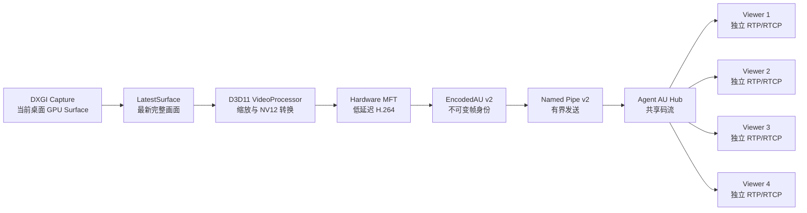
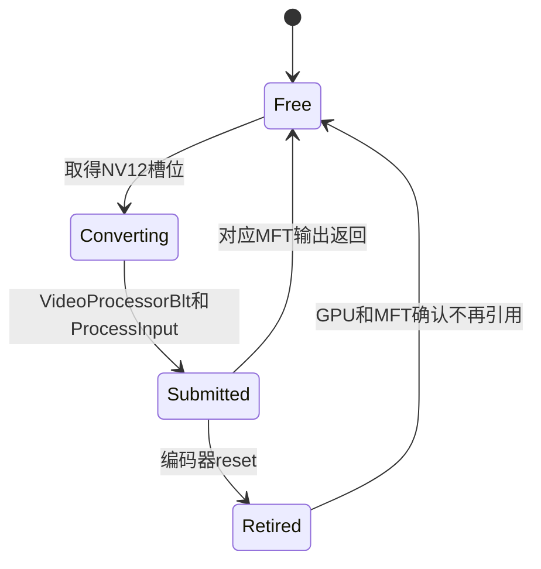
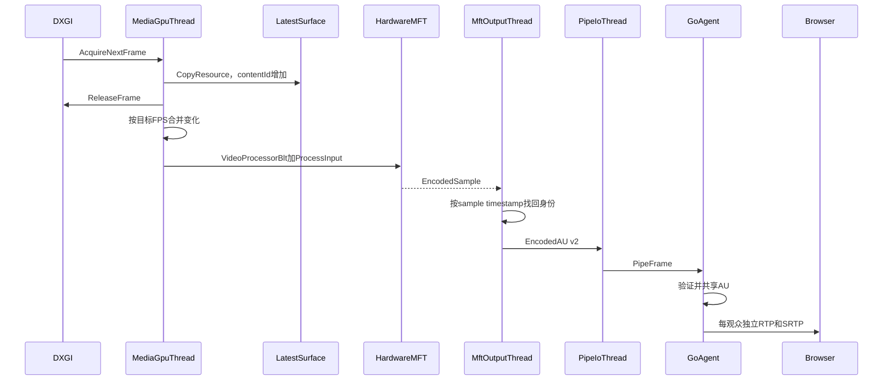
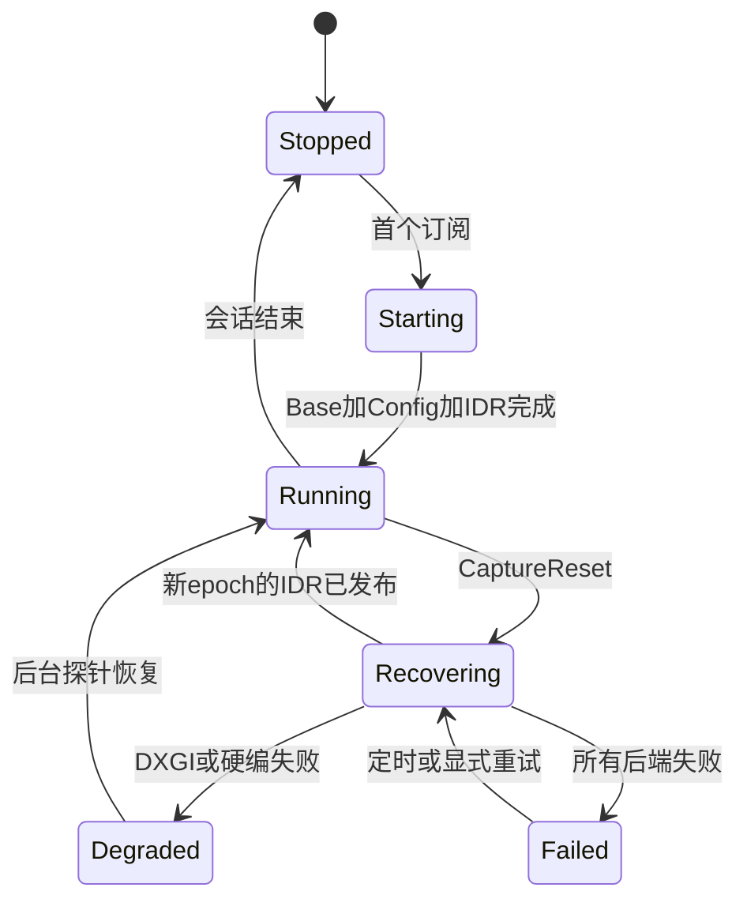
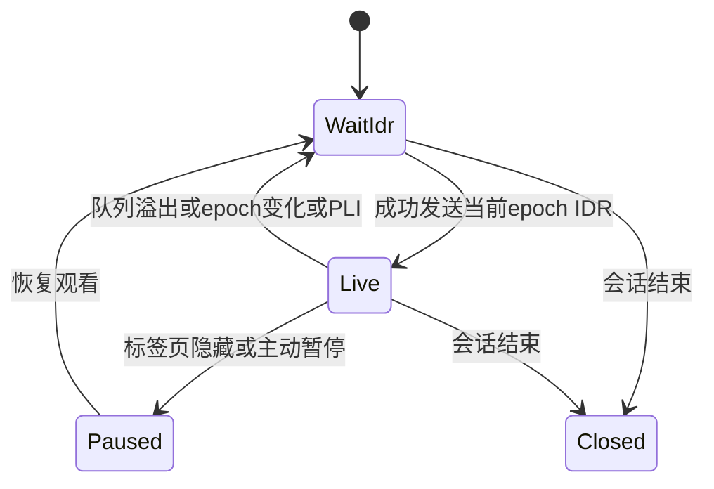

# XNC Desktop Media Pipeline 系统设计

> 版本 v1.0 · 2026-08-26 · 状态：已批准  
> 一句话定位：为 XNC 的 Windows → Browser 远程桌面重建一条帧身份可追踪、GPU 优先、队列有界、可自愈的视频链路。

## 1. 产品概述

### 1.1 目标用户与角色

- 控制者：通过 Chrome/Edge 查看并操作一台 Windows 10/11 节点。
- 旁观者：只观看同一节点的视频，单节点最多 3 名旁观者。
- 运维者：需要通过稳定指标和帧身份追踪定位采集、编码、传输或浏览器问题。

### 1.2 现状痛点

当前 `DXGI → xnc-desktop → named pipe → Go/Pion → TURN → Browser` 链路存在可复现的正确性缺陷：

1. DXGI 双 staging 在事件 N 写入当前帧、读取上一缓冲，静止后下一次变化可能输出很久以前的帧。
2. `FrameCache` 实际保存 generation 首帧而非最新完整帧；新观众、PLI 或队列恢复会把历史帧重新编码为 IDR。
3. MFT 延迟输出没有保留输入身份，输出 AU 被错误赋予当前调用帧的时间戳。
4. Pion `WriteSample(Duration)` 把本帧间隔应用到下一帧，静止间隔在 RTP 时间轴中错位。
5. 浏览器只能看到表面单调的媒体时间，无法证明最终展示的是哪个桌面内容。

### 1.3 成功标准

- 8 小时静止/运动、订阅切换和故障注入测试中，旧帧回退、epoch 逆序、未恢复冻结均为 0。
- 1080p60 硬件路径的捕获到 AU 延迟 p95 < 15 ms，CPU < 15%。
- LAN/TURN 受控环境中，输入到画面反馈 p95 < 150 ms，首个可展示帧 p95 < 1 s。
- 静止桌面稳定后视频 0fps；所有媒体队列有固定上限且延迟不积累。

### 1.4 已确认约束

- Windows 10/11 Host，Chrome/Edge Browser。
- 默认 1080p30，上限 1440p60。
- WebRTC 强制 TURN/TLS/TCP 443 relay-only。
- Host、Agent、Web 可以协同升级，不要求兼容旧 desktop 内部 wire。
- 单节点共享一次采集和一次编码：1 名控制者 + 最多 3 名旁观者。
- 首版使用 Windows Media Foundation；不随包引入 FFmpeg 或厂商编码 SDK。
- 保留系统软件 H.264 和 GDI 降级后端。
- 分阶段替换，每阶段保持可运行、可回退、可验收。

### 1.5 本期不做

- 4K、HDR、4:4:4、AV1、HEVC。
- 多路转码、simulcast、SVC 或每观众独立画质。
- P2P 直连或自研 UDP/QUIC 媒体协议。
- 把 WebRTC、RTP 或厂商 SDK 下沉到 `xnc-desktop`。
- Linux/macOS Host。

## 2. 核心需求与场景

| 编号 | 用户故事 | 优先级 | 验收标准 |
| --- | --- | --- | --- |
| R1 | 作为控制者，我要始终看到当前桌面，以便不会操作历史画面 | P0 | 像素级旧帧回归与 8h soak 均为 0 回退 |
| R2 | 作为控制者，我要低延迟、流畅的视频，以便鼠标键盘操作有即时反馈 | P0 | 1080p60 捕获到 AU p95 <15ms；反馈 p95 <150ms |
| R3 | 作为新观众，我要从可解码的当前画面进入，以便不会黑屏或看到 generation 首帧 | P0 | freshness barrier 后 Config + 当前 LatestSurface IDR |
| R4 | 作为控制者，我要在拥塞和丢包后快速恢复，以便延迟不持续累积 | P0 | 队列有界；编码后丢帧进入 WAIT_IDR；PLI 展示 p95 <1s |
| R5 | 作为旁观者，我的慢网络不应阻塞控制者 | P0 | 每观众独立发送状态；慢旁观者暂停而非拖垮全局 |
| R6 | 作为运维者，我要追踪一帧穿过全部组件的身份，以便定位内容与时间戳错配 | P0 | 四元身份与 frame-meta 能关联 Host、RTP、Browser |
| R7 | 作为运维者，我要在 GPU、桌面和显示器异常后自动恢复 | P0 | 统一 reset；实机矩阵与故障注入通过 |

## 3. 方案比较与决策

### 3.1 方案 A：局部修补

保留 `DXGI → CPU/NV12 → 软件 MFT → pipe → TrackLocalStaticSample`，只修 staging、FrameCache、MFT 时间戳和 Pion Duration。

- 优点：改动小、止血快。
- 缺点：CPU 拷贝、软件编码前瞻和隐含 RTP 时间轴仍在，不能稳定满足最终性能目标。
- 决策：仅作为 M0 过渡，不是最终架构。

### 3.2 方案 B：GPU-first 分层重构

保留 C++ Host 与低权限 Go Agent 的安全边界，重新定义 GPU surface、编码输入输出、AU、pipe、RTP 和浏览器观测契约。

- 优点：热路径不出 GPU；每层职责单一；可精确测试内容、身份和时间轴；现有进程隔离不变。
- 缺点：需要 pipe v2 和 Host/Agent/Web 协同升级。
- 决策：采用。

### 3.3 方案 C：C++ 单体媒体栈

把 WebRTC、RTP 和厂商编码 SDK 全部下沉到 `xnc-desktop`。

- 优点：理论性能上限最高。
- 缺点：破坏权限隔离，显著扩大第三方依赖、许可证、攻击面和维护成本。
- 决策：不采用。

## 4. 总体架构



### 4.1 组件职责

| 组件 | 职责 |
| --- | --- |
| `DisplayCaptureService` | 管理目标桌面、显示器、DXGI/GDI 后端和采集健康 |
| `LatestSurface` | 在 GPU 中持有最近一次有效的完整桌面内容 |
| `MediaGpuThread` | 独占 D3D immediate context，执行采集、复制、转换和 MFT 输入 |
| `EncoderSession` | 枚举、探测、配置和监督硬件/软件 MFT |
| `MftOutputThread` | 将输出 sample 精确匹配回输入并生成不可变 AU |
| `AuPublisher` | 管理 Host 侧有界输出、discontinuity 和 Pipe v2 |
| `AuHub` | Agent 内验证并扇出共享 AU，不改变帧身份 |
| `ViewerSender` | 每观众独立 RTP packetizer、RTCP、发送状态和重传缓存 |
| `QoSController` | 将 TWCC/RTCP/浏览器反馈转换为全局编码配置 |
| `FrameTelemetry` | 关联 Host、Agent、RTP 与 Browser 的帧身份 |

### 4.2 线程边界

| 线程 | 唯一职责 |
| --- | --- |
| `MediaGpuThread` | DXGI Acquire、GPU Copy、VideoProcessor 转换、MFT `ProcessInput` |
| `MftOutputThread` | 异步读取输出、匹配输入身份、NAL 校验、生成 AU |
| `PipeIoThread` | Pipe v2 控制消息与 AU 发送，不接触 D3D surface |
| `Control/Cursor/Input` | 订阅、配置、桌面监控、光标与输入；独立于视频热路径 |

D3D11 immediate context 只能由 `MediaGpuThread` 使用，禁止通过全局锁让多个线程共享。

## 5. 帧身份与时间语义

### 5.1 四种身份

| 字段 | 变化条件 | 语义 |
| --- | --- | --- |
| `captureEpoch` | 显示器、桌面、采集后端或 D3D 设备重建 | 隔离不同采集世代 |
| `codecEpoch` | 编码器、分辨率、profile 或 SPS/PPS 改变 | 隔离不同解码配置 |
| `contentId` | 新桌面内容成功复制到 LatestSurface | 标识具体像素内容 |
| `encodeSeq` | 每次成功提交编码输入 | 将 MFT 输出精确对应到输入 |

同一 epoch 内 `contentId` 和 `encodeSeq` 必须严格单调，不得回退或复用。

### 5.2 两种时间

- `sourceMonoUs`：像素首次从桌面捕获的时间。重复编码静止画面时保持不变。
- `presentMonoUs`：本次编码结果应进入媒体时间轴的时间。新观众或 PLI 对静止画面重新编码时取当前时间。

禁止用 MFT 输出到达时间覆盖 `sourceMonoUs`，也禁止把触发 `ProcessOutput` 的当前输入身份赋给延迟输出。

### 5.3 编码输入登记

每次 `ProcessInput` 建立：

```text
MFT sample timestamp
  → {captureEpoch, codecEpoch, contentId, encodeSeq,
     sourceMonoUs, presentMonoUs, surfaceLease}
```

输出 sample 必须使用自身 timestamp 找回该记录。找不到、重复或逆序时：停止发布、记录稳定错误、重建或淘汰编码器。

## 6. GPU Surface 所有权



硬契约：

1. DXGI 当前帧全量 `CopyResource` 到自有 `LatestSurface`，随后立即 `ReleaseFrame`。
2. 首版不使用 dirty/move rect 重建像素；它们只作为诊断信息。全量 GPU copy 优先保证正确性。
3. `LatestSurface` 永远是最近一次有效完整桌面，不保存 generation 首帧和历史 CPU BGRA。
4. VideoProcessor 将 LatestSurface 转换到独立 NV12 slot。
5. MFT 对应输出返回或 session 被安全注销前，NV12 slot 不得复用。
6. NV12 pool 初始固定 3 个 slot，不因拥塞增长。
7. GDI fallback 通过 CPU upload 更新同一 LatestSurface 抽象。

## 7. 正常采集与编码流程



调度规则：

- 默认 30fps，上限 60fps；编码窗口内多个变化只编码最新 content。
- 编码器没有空闲 slot 时继续维护 LatestSurface，不累计待编码帧。
- 只有鼠标变化时不编码视频，继续走 cursor 通道。
- DXGI `WAIT_TIMEOUT` 表示静止，不产生帧、不降低健康分。
- 无观众时 1 秒探活；首个观众加入时执行 freshness barrier。

### 7.1 静止画面与 freshness barrier

```text
新观众 / PLI / FIR
  → 合并尚未处理的 DXGI 更新
  → AcquireNextFrame(0) 直到 WAIT_TIMEOUT
  → 验证 captureEpoch 健康且 LatestSurface 有效
  → 对 LatestSurface 提交一次 ForceNextIDR
  → 产生带当前 presentMonoUs 的新 IDR
```

采集处于 reset、设备丢失或没有 base surface 时必须等待恢复，禁止用历史缓冲顶帧。

## 8. 编码器

### 8.1 选择梯子

```text
同 adapter、D3D11-aware 的硬件 H.264 MFT
  → 其他可用硬件 H.264 MFT
  → 系统软件 H.264 MFT
  → FAILED
```

硬件 MFT 使用 `IMFDXGIDeviceManager` 接收 D3D11 texture；正常路径不进行 GPU→CPU readback。

### 8.2 低延迟配置

- B 帧关闭。
- `CODECAPI_AVLowLatencyMode` 开启。
- 异步深度 1，小 VBV，允许丢帧。
- `ForceNextIDR` 由下一次成功 `ProcessInput` 原子消费一次。
- 码率和 FPS 可以热更新；分辨率、profile 或 SPS/PPS 变化必须重建 codec epoch。
- 每个 IDR 自包含 SPS、PPS 和 IDR slice。

### 8.3 启动探针

每个候选编码器必须：

1. 输入至少 8 个具有不同 contentId 的合成纹理。
2. 第一输出不超过 2 个输入帧或 100 ms。
3. 输出 sample timestamp 能逐一映射到输入。
4. IDR NAL 结构合法并携带 SPS/PPS。
5. 解码后的像素签名与输入一致。

不满足任一项的编码器不得进入正式流。

### 8.4 颜色

- 720p 及以上：BT.709 limited range。
- 更低分辨率：BT.601 limited range。
- 编码宽高规范化为偶数。
- SPS/VUI、转换矩阵和浏览器展示保持一致。

## 9. 有界队列与断流恢复

| 边界 | 上限 | 溢出行为 |
| --- | ---: | --- |
| 捕获→编码 | 最新内容 1 份 | 覆盖未编码旧内容 |
| MFT in-flight | 3 个 surface | 暂停提交，保留最新内容 |
| 编码→pipe | 2 个 AU / 8 MiB | 清空、discontinuity、请求 IDR |
| Agent 全局 AU hub | 1 个 AU | 不积压历史 AU |
| 每观众 RTP 队列 | 1 个完整帧 | 该观众进入 WAIT_IDR |
| Browser decode queue | 目标 ≤2 | 上报 QoS，恢复到下一 IDR |

编码前丢帧不破坏参考链；编码后丢失 P 帧时必须：

```text
清空消费者队列 → WAIT_IDR → 抑制P帧
  → 合并请求全局IDR → 收到并成功发送IDR后恢复
```

## 10. Pipe v2 与 EncodedAU

### 10.1 AU 头部

```text
protocolVersion
captureEpoch / codecEpoch
contentId / encodeSeq
sourceMonoUs / presentMonoUs
width / height / codec / flags
payloadLength / CRC32C
Annex-B payload
```

### 10.2 协议约束

- AU 创建后不可变，可在 Agent 内共享 payload。
- 单 AU 最大 8 MiB，所有长度计算使用溢出安全检查。
- Pipe reader 必须验证版本、长度、CRC、epoch 单调性和 NAL 边界。
- Agent 不重写帧身份，只负责验证、扇出和 RTP 映射。
- codec 配置变化的顺序固定为 `CODEC_CONFIG → IDR → P...`。

## 11. 统一 Reset



`CaptureReset(reason)`：

1. 停止接受新编码输入。
2. 广播 `STREAM_DISCONTINUITY`，禁止旧 epoch 后续 AU 发布。
3. Flush 编码器并注销 pending 输入；异常恢复时丢弃 drain 输出。
4. 等待或取消 surface lease，释放 duplication、MFT 和必要的 D3D 对象。
5. 按故障范围重绑桌面、重新枚举输出或重建 D3D device。
6. `captureEpoch++`，清除 LatestSurface 有效标志。
7. 获取新完整 base surface。
8. 必要时重建编码器并令 `codecEpoch++`。
9. 发布新的 display/codec config。
10. 对新 base 强制一次 IDR；成功发布后进入 RUNNING。

Reset 请求串行、合并原因并指数退避；一次真实重建只增加一次 epoch。

### 11.1 故障分类

| 事件 | 行为 |
| --- | --- |
| `WAIT_TIMEOUT` | 静止，不 reset |
| 新观众、PLI、FIR | freshness barrier + 当前 LatestSurface IDR |
| 编码前丢帧 | 编码最新内容，无需 IDR |
| 编码后或 pipe 丢 AU | discontinuity，抑制 P 帧，等待 IDR |
| `DXGI_ERROR_ACCESS_LOST` | 重建 duplication，captureEpoch 增加 |
| `DEVICE_REMOVED/HUNG` | 重建 D3D、capture 和 encoder |
| 分辨率、旋转、显示器切换 | 更新 capture/codec epoch，Config + IDR |
| MFT 身份错配、超时、坏 NAL | 淘汰 encoder，重建或降级 |
| Pipe 断开 | hibernate，不重放历史 AU |
| DXGI 连续失败 | GDI + 软件编码；30秒后台探测 |
| 硬编连续失败 | 当前进程生命周期锁定软件 fallback，防抖动 |

## 12. RTP 与每观众发送

### 12.1 显式时间轴

```text
rtpTimestamp = randomBase
             + round((presentMonoUs - firstPresentMonoUs) * 90000 / 1000000)
```

- 每观众保存独立 base、SSRC、sequence 和换算余数。
- 一个 AU 的所有包共享 timestamp。
- 静止间隔反映在当前恢复帧 timestamp 上。
- 不再使用 `TrackLocalStaticSample.WriteSample(Duration)` 隐式累计时间。

### 12.2 H.264 packetizer

- `packetization-mode=1`。
- RTP payload 目标 ≤1200 字节。
- 大 NAL 使用 FU-A；marker 只出现在 AU 最后一个包。
- SPS/PPS 随 IDR 发送。
- AU payload 只读共享；RTP header 和 packet 每观众独立生成。

### 12.3 ViewerSender 状态



`WAIT_IDR` 期间不得发送 P 帧。慢观众不能阻塞 AU hub、Host pipe 或其他观众。

## 13. IDR 协调

请求来源：新观众、PLI、FIR、pipe discontinuity、viewer queue overflow、codec epoch 变化、活动画面周期恢复。

- 合并同时到达的请求。
- 普通 PLI 最短间隔 250 ms；新观众和 epoch 变化可绕过冷却。
- 请求提交后 250 ms 或两个编码周期仍无 IDR，触发编码器健康检查。
- IDR 广播给全部观众；只有成功发送该 IDR 的观众回到 LIVE。
- 活动画面最长 GOP 暂定 5 秒；静止时无周期视频，仅响应恢复事件。

## 14. QoS 与 TURN/TCP

### 14.1 共享码流约束

首版单编码流无法给不同观众提供独立画质：

- 控制者是主要 QoS 样本。
- 可见观众参与共享码率下限。
- 隐藏/暂停观众不参与。
- 旁观者可用带宽连续低于控制者 35% 时暂停其视频并明确提示；恢复后从 IDR 重新加入。

### 14.2 自适应梯子

```text
FPS: 60 → 30 → 20 → 15 → 10 → 5
分辨率: 1440p → 1080p → 900p → 720p
码率: 0.5–15 Mbps
```

| 档位 | 初始码率 |
| --- | ---: |
| 1080p30 | 4 Mbps |
| 1080p60 | 7 Mbps |
| 1440p30 | 7 Mbps |
| 1440p60 | 10 Mbps |

- 可用带宽只使用 85%，为 TURN/TCP 重传和 IDR 突发留余量。
- 下降每秒最多一次，可立即降低 30%。
- 升档需稳定 10 秒，每 3 秒最多增加 15% 或 1 Mbps。
- `sendQueueAge >100ms`、持续丢包、RTT 恶化或 decode queue >2 时立即降档。
- 优先降码率和 FPS，再降分辨率，以保持文字清晰。
- 分辨率/profile 变化走 codec epoch reset。

### 14.3 TURN/TCP 专项

- 发送队列目标 <50 ms，硬上限 100 ms。
- NACK 重传缓存窗口 250 ms，不发送超过播放期限的重传。
- IDR 受 VBV 和 packet pacer 限制。
- 不以增加队列换吞吐；无法实时发送时降档或暂停慢旁观者。

## 15. Browser 与帧可观测性

浏览器使用原生 `RTCPeerConnection → MediaStreamTrack → video`，不假设 WebCodecs 能控制 WebRTC 内部解码队列。

- 同一协商 profile 内的分辨率变化由 SPS/PPS + IDR 恢复。
- codec/profile 真正变化时先完成 SDP 重新协商。
- 新 epoch 进入 WAIT_IDR，首个可展示帧必须是该 epoch IDR。

浏览器每秒上报：

- `framesDecoded`、`framesDropped`
- `jitterBufferDelay / jitterBufferEmittedCount`
- `packetsLost`、`nackCount`、`pliCount`
- `freezeCount`、冻结持续时间
- `requestVideoFrameCallback` 展示间隔
- 页面可见性和 decode queue 压力

增加不可靠、无重传的 `frame-meta` DataChannel：

```text
{codecEpoch, contentId, encodeSeq, rtpTimestamp, sourceMonoUs, hash64}
```

浏览器通过视频帧回调的 RTP timestamp 关联最终展示帧。`hash64` 使用会话级密钥计算，不保存桌面像素或可跨会话复用的内容指纹。

## 16. 可观测性

所有阶段记录同一关联键：

```text
captureEpoch / codecEpoch / contentId / encodeSeq
```

直方图：

```text
dxgi_wait_us
gpu_copy_us
gpu_convert_us
mft_submit_to_output_us
pipe_queue_age_us
au_bytes
rtp_queue_age_us
viewer_jitter_buffer_ms
capture_to_present_ms
```

运行时异常：

- 同 epoch 内 contentId 或 encodeSeq 回退。
- 同 contentId 出现不同 keyed hash。
- MFT 输出找不到输入。
- WAIT_IDR 发送 P 帧。
- 队列超过声明上限。
- Browser 展示 contentId 回退。

异常触发时保存最近 10 秒的结构化元数据环形轨迹，不保存原始桌面像素。

## 17. 测试与质量

### 17.1 测试分层

| 层级 | 测试内容 |
| --- | --- |
| 纯逻辑单测 | 身份、epoch、队列、IDR 协调、90kHz 时间换算 |
| Native 组件 | surface 租约、MFT 输入输出配对、NAL 校验 |
| Pipe 交叉测试 | C++ AU → Pipe v2 → Go，含截断、畸形和 CRC |
| WebRTC 环回 | AU → RTP → Pion 接收 → H.264 解码 → 像素签名 |
| Browser E2E | TURN/TCP、真实 Chrome/Edge、渲染和统计 |
| 实机故障注入 | 锁屏、UAC、显示变化、GPU reset、慢网络 |
| Soak | 静止/运动、订阅、PLI、断线恢复 |

### 17.2 旧帧回归

```text
A（红色+ID1）→ B（绿色+ID2）→ C（蓝色+ID3）
→ 静止10分钟 → PLI/新观众/队列溢出
```

恢复后的首个 IDR 解码结果必须是 C。GPU NV12 与 BGRA 两条 DXGI 路径分别执行；测试必须解码像素，不能只检查 IDR 标志或时间戳。

### 17.3 时间轴和队列

- 模拟 MFT 延迟 17 帧和 Flush 多输出，验证逐输入映射。
- 静止 30 秒后，间隔落在当前 RTP frame。
- 90kHz 换算运行 8 小时无漂移、回退和溢出。
- 编码后丢 P 帧一定进入 WAIT_IDR。
- 慢观众溢出不影响其他观众。
- epoch 后第一帧必须为相应 Config 的 IDR。

### 17.4 GPU/设备矩阵

- Intel、NVIDIA、AMD、混合显卡、软件-only/VM。
- Windows 10、Windows 11。
- 单屏、多屏、旋转、分辨率变化。
- Default、Winlogon/UAC、锁屏、用户切换。

D3D11 Debug Layer 的 resource hazard、线程违规和 live object 增长均视为失败。

### 17.5 故障注入

| 注入 | 预期 |
| --- | --- |
| 连续 WAIT_TIMEOUT | 保持静止，不 reset |
| ACCESS_LOST | 单次合并 reset，2秒内恢复 |
| DEVICE_REMOVED | 重建 D3D 和 encoder |
| MFT 延迟、错序、丢输出 | 淘汰 encoder 并降级 |
| Pipe 阻塞 | 有界丢弃、discontinuity、IDR |
| 单观众网络骤降 | 只暂停该观众 |
| TURN 中断 | 重连，不重放历史 AU |
| Browser 隐藏/恢复 | Paused → WAIT_IDR → Live |
| PLI 风暴 | 请求合并，无 IDR 风暴 |
| 反复重建 | 退避生效，epoch 有界增长 |

### 17.6 发布门

| 指标 | 门槛 |
| --- | ---: |
| GPU Copy + NV12 p95 | <3ms |
| 捕获到硬编 AU p95 @1080p60 | <15ms |
| LAN 输入到画面反馈 p95 | <150ms |
| 首个可展示帧 p95 | <1s |
| PLI 到 Host IDR p95 | <100ms |
| PLI 到 Browser 展示 p95 | <1s |
| 目标 FPS 达成率 | ≥95% |
| 发送队列 p95 / hard max | <50ms / 100ms |
| CPU @1080p60硬编 | <15% |
| xnc-desktop 内存 | <350MB且无持续增长 |
| 静止桌面 | 稳定后0视频帧 |
| 8h soak | 0旧帧、0逆序、0未恢复冻结 |

## 18. 迁移里程碑

| 阶段 | 内容 | 预计工程量 | 完成标志 |
| --- | --- | ---: | --- |
| M0 | 修 staging、LatestFullFrame、MFT 映射、Pion timestamp；建立像素回归 | 2–3天 | 现有链路旧帧测试转绿 |
| M1 | epoch/contentId/encodeSeq、Pipe v2、不可变 AU | 3–5天 | Host/Go 交叉与 fuzz 测试通过 |
| M2 | LatestSurface、VideoProcessor、硬件 MFT、surface pool | 7–10天 | GPU 路径性能门通过 |
| M3 | 显式 RTP、每观众状态、TWCC QoS、frame-meta | 5–8天 | TURN/Browser E2E 门通过 |
| M4 | 设备矩阵、故障注入、灰度和旧路径清理 | 5–7天 | 8h soak 和灰度指标通过 |

按一名熟悉 C++/Go 的工程师估算总量约 4–6 周。每阶段通过 `desktop_pipeline_v2` feature flag 独立启用和回退；所有门槛通过后删除 v1。

## 19. 风险与缓解

| 风险 | 缓解 |
| --- | --- |
| 硬件 MFT/驱动差异 | 启动像素探针、稳定错误码、软件 fallback、当前进程防抖锁定 |
| 单编码流无法适配极慢旁观者 | 控制者优先；暂停慢旁观者；V2 再评估 simulcast/SVC |
| TURN/TCP 队头阻塞 | 85%带宽利用、严格 queue age、packet pacing、短 NACK 窗口 |
| Browser 解码器不可直接观察 | frame-meta + rVFC RTP timestamp + W3C stats |
| reset 并发与风暴 | 单一协调器、原因合并、指数退避、一次重建一次 epoch |
| frame hash 形成隐私指纹 | 会话级 keyed hash，不存像素，不跨会话复用 |

## 20. 外部架构依据

- Microsoft Desktop Duplication API：完整 GPU surface、dirty/move metadata、及时 ReleaseFrame。  
  <https://learn.microsoft.com/en-us/windows/win32/direct3ddxgi/desktop-dup-api>
- Microsoft Media Foundation Low Latency：低延迟编码不应增加重排序延迟，输入输出预期一一对应。  
  <https://learn.microsoft.com/en-us/windows/win32/medfound/codecapi-avlowlatencymode>
- RustDesk video service：变化驱动采集、QoS 调整、捕获后端 fallback。  
  <https://github.com/rustdesk/rustdesk/blob/master/src/server/video_service.rs>
- Sunshine video pipeline：GPU memory type 匹配、低延迟硬编配置、独立 IDR 请求和 frame index。  
  <https://github.com/LizardByte/Sunshine/blob/master/src/video.cpp>
- Moonlight depacketizer：队列溢出或参考链破坏后清队列并等待 IDR。  
  <https://github.com/moonlight-stream/moonlight-common-c/blob/master/src/VideoDepacketizer.c>
- Pion WebRTC：RTP/RTCP interceptor、TWCC 和 congestion-control feedback。  
  <https://github.com/pion/webrtc/blob/main/interceptor.go>
- W3C WebRTC Stats：framesDropped、jitterBufferDelay 等接收端指标。  
  <https://www.w3.org/TR/webrtc-stats/>

以上仅提取公开架构经验；XNC 不复制或链接 AGPL 项目代码。

## 21. 闭环自查

| 需求 | 架构组件 | 里程碑 | 验收/测试 |
| --- | --- | --- | --- |
| R1 当前桌面正确性 | LatestSurface、身份契约、freshness barrier | M0–M2 | A/B/C像素回归、8h soak |
| R2 低延迟流畅 | GPU thread、VideoProcessor、硬件 MFT | M2 | <15ms、<15% CPU、FPS门 |
| R3 新观众当前IDR | KeyframeCoordinator、LatestSurface | M1–M3 | 静止10分钟后新观众测试 |
| R4 拥塞恢复 | 有界队列、WAIT_IDR、QoS | M1–M3 | 溢出、PLI、TURN限速测试 |
| R5 慢观众隔离 | ViewerSender、AU hub | M3 | 单观众骤降故障注入 |
| R6 帧追踪 | 四元身份、frame-meta、结构化指标 | M1–M3 | Host/RTP/Browser关联断言 |
| R7 自动恢复 | CaptureReset、后端梯子、退避 | M2–M4 | GPU/桌面/显示器故障矩阵 |

所有 P0 需求均已映射到架构组件、迁移阶段和可执行验收。
